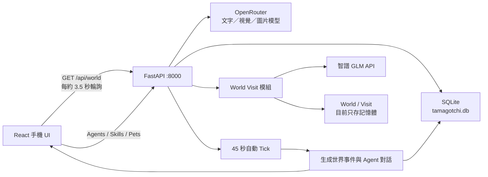

# My Tamagotchi / ForkWorld 後端技術解析

> 範圍：以軟體與後端為主，不包含硬體實作

## 摘要

目前真正接到手機 UI 的主線是：

- React + TypeScript 手機前端
- FastAPI 共用後端
- SQLModel + SQLite 持久化
- OpenRouter 文字、視覺與圖片模型
- 智譜 GLM 世界生成與世界互訪模組

畫面裡 Agent 自動冒出的聊天泡泡，是「世界演化事件」生成的，不是使用者直接與 Agent 聊天。

一對一聊天 API 已完成，但前端目前沒有實際呼叫。repo 內還存在一套 Node.js 世界引擎，功能與資料模型更完整，但它與 FastAPI 不是同一條主線；部分文件描述的 Redis、MQTT、完整 WebSocket 等架構也尚未在目前主服務落地。

---

## 一、目前實際架構



前端預設以 `/api` 呼叫後端，Vite 開發代理指向 `localhost:8000`，也就是 FastAPI。

主要檔案：

- `frontends/mobile/vite.config.ts`
- `frontends/mobile/src/app/backendApi.ts`
- `frontends/mobile/src/app/worldApi.ts`
- `backend/app/main.py`
- `backend/app/world.py`
- `backend/app/llm.py`

---

## 二、Agent 聊天內容如何生成

repo 內有三種不同意義的「聊天」，必須分開理解。

### 2.1 畫面城鎮中的自動聊天泡泡

這是目前 Demo 畫面真正會看到的主要 Agent 對話。

流程如下：

1. FastAPI 啟動後建立背景迴圈。
2. 每 45 秒執行一次 world tick。
3. 隨機選擇世界、地點、事件類型與 2–3 位 Agent。
4. 把 Agent 的名字、物品類型、性格、心情送給 LLM。
5. LLM 回傳事件標題、摘要、3–5 句對話及後續影響。
6. 結果寫入 `worldeventrow`。
7. 參與 Agent 各自新增一筆 `Memory(kind="world")`。
8. 前端約每 3.5 秒讀取 `/api/world`。
9. 前端發現新事件後，依序顯示事件中的對話泡泡。

相關實作：

- 背景 tick：`backend/app/main.py`
- 世界事件生成：`backend/app/world.py`
- 前端輪詢：`frontends/mobile/src/app/useWorldEvolution.ts`
- 對話泡泡：`frontends/mobile/src/app/App.tsx`

#### System Prompt

```text
你是像素小世界的叙事引擎，为几个物品 agent 生成一段小事件。只输出 JSON。
```

#### User Prompt 結構

```text
地点：{location}；事件类型：{etype}。参与者：
agent-{id}: {name}（{category}，性格：{trait}，心情：{mood}）

输出 JSON：
{
  "title": "10字内事件标题",
  "summary": "40字内摘要",
  "dialogue": [
    {"agentId": "agent-数字", "text": "25字内台词"}
  ],
  "consequence": "25字内后续影响"
}
```

目前這個 Prompt 沒有把 Agent 的歷史記憶送入 LLM，因此世界事件對話具備 Agent 人設，但還不算真正基於長期記憶的決策或推理。

### 2.2 使用的模型

FastAPI 統一透過 OpenRouter 的 OpenAI-compatible `/chat/completions` API。

目前 `backend/.env` 指定的主要文字模型是：

```text
nvidia/nemotron-3-super-120b-a12b:free
```

Fallback 順序：

1. `nvidia/nemotron-3-super-120b-a12b:free`
2. `nvidia/nemotron-3-nano-30b-a3b:free`
3. `google/gemma-4-26b-a4b-it:free`
4. `openai/gpt-oss-20b:free`
5. JSON 解析仍失敗時：`google/gemini-3.1-flash-lite`

如果沒有 API key、模型失敗或網路失效，則會退回幾句本地預設台詞，例如：

```text
（伸了个懒腰）你回来啦！
今天也要加油哦！
我把这件事记在心里了。
```

這讓 Demo 不會因為 LLM 服務暫時失效而直接回傳 500。

### 2.3 使用者與單一 Agent 一對一聊天

端點：

```http
POST /api/agents/{agent_id}/chat
Content-Type: application/json

{
  "text": "今天工作好累"
}
```

執行流程：

1. 從 SQLite 讀取 Agent。
2. 讀取該 Agent 的 Memory。
3. 取最近 8 筆記憶。
4. 讀取 Agent 擁有的所有 Skill 名稱。
5. 組出 persona system prompt。
6. 將使用者輸入作為 user message。
7. 呼叫 OpenRouter。
8. 把「主人對我說了什麼」存入 Memory。
9. 提升 Agent mood 8 點。

#### Persona Prompt

```text
你是一个像素风电子宠物世界里的物品 agent。
名字：{agent.name}；类型：{agent.category}；性格：{agent.trait}。
你拥有的技能：{skill names}。
你的记忆：
- {最近八条记忆}

始终用简体中文、以第一人称、符合性格地说话，回复要口语化且不超过60字，
可以带一点符合物品身份的小动作描写（用括号）。
```

#### 目前的重要限制

前端 client 已經定義 `backendApi.chat()`，但目前沒有 UI 實際呼叫它。

因此：

- 後端一對一聊天功能存在。
- 畫面上的城鎮泡泡不是來自這個 API。
- 若 Demo 要展示「我跟自己的 Agent 說話，它記住了」，還需要補聊天 UI 或用 API 操作介面展示。

另外，目前只保存使用者訊息：

```text
主人对我说：今天工作好累
```

LLM 回覆本身沒有存入 Memory，因此目前不是完整的 conversation history。

### 2.4 Node 版聊天

Node 世界引擎另有：

```http
POST /api/agents/:id/chat
```

但這個端點不會呼叫 LLM，而是回傳固定模板：

```text
{agent.name}在{location}旁认真想了想你的话：
“我会把这个问题带进下一次选择。它不是命令，而是一种新的可能。”
```

Node 版的 LLM 只用在世界事件敘事，而且預設：

```text
WORLD_LLM_ENABLED=false
```

因此預設仍是 deterministic local generation。啟用後，預設模型才是：

```text
gpt-4.1-mini
```

Demo Day 不應把 Node 版與 FastAPI 版混著講。

---

## 三、Agent Memory 如何儲存

### 3.1 FastAPI 主線：SQLite + SQLModel

資料庫位置：

```text
backend/tamagotchi.db
```

Memory schema：

```sql
CREATE TABLE memory (
    id INTEGER PRIMARY KEY,
    agent_id INTEGER NOT NULL,
    kind VARCHAR NOT NULL,
    content VARCHAR NOT NULL,
    created_at DATETIME NOT NULL,
    FOREIGN KEY(agent_id) REFERENCES agent(id)
);
```

對應 JSON 表示：

```json
{
  "id": 123,
  "agent_id": 3,
  "kind": "world",
  "content": "[咖啡馆的偶遇] 豆豆和墨墨讨论了主人的近况。",
  "created_at": "2026-07-24T12:00:00+00:00"
}
```

### 3.2 Memory kind

目前實際會出現：

| kind | 用途 |
|---|---|
| `chat` | 主人聊天、Agent 出生 |
| `diary` | 主人的日記 |
| `camera` | 拍照生成角色 |
| `plaza` | 廣場交流、技能學習 |
| `world` | 世界演化事件 |
| `skill` | 技能使用、技能鍛造 |

程式註解沒有列出 `skill`，但實際會寫入。

### 3.3 目前資料量

截至本次檢查，SQLite 內有：

| 資料 | 數量 |
|---|---:|
| Agent | 10 |
| Memory | 160 |
| World Event | 50 |
| Skill | 15 |
| Artifact | 13 |

Memory 分布：

| kind | 數量 |
|---|---:|
| world | 112 |
| plaza | 25 |
| skill | 13 |
| diary | 5 |
| camera | 3 |
| chat | 2 |

### 3.4 Memory 檢索方法

目前沒有向量資料庫、embedding、semantic search 或 RAG。

一對一聊天的檢索方式：

```text
按 created_at 正序讀取全部
→ 取最後 8 筆
→ 直接插入 system prompt
```

世界 API：

```text
按 created_at 倒序
→ 取 12 筆
→ 轉成 WorldMemory
```

轉換後補入固定值：

```json
{
  "id": "mem-123",
  "tick": 0,
  "type": "episodic",
  "text": "...",
  "importance": 3,
  "emotion": "平静",
  "participants": []
}
```

所以目前 Memory 的準確技術描述是：

> 基於 SQLite 的 append-only episodic memory，使用 recency window 注入 Prompt。

目前不能宣稱已經具備：

- 長期語意記憶
- 向量檢索
- 自動摘要
- importance-based retrieval
- 記憶衰退
- Memory consolidation
- 完整 reflection-based learning

### 3.5 Node 版 Memory schema

Node 版的 JSON world state 比 FastAPI 詳細：

```json
{
  "id": "event-0042-miko",
  "tick": 42,
  "type": "episodic",
  "text": "...",
  "importance": 81,
  "emotion": "curious",
  "participants": ["folio", "nana"]
}
```

每位 Agent 還有：

```json
{
  "beliefs": [],
  "memories": [],
  "reflections": [
    {
      "tick": 40,
      "text": "...",
      "changedTrait": "curiosity",
      "newBelief": "..."
    }
  ],
  "relationships": {
    "other-agent-id": {
      "affinity": 52,
      "trust": 48,
      "sharedEvents": 3,
      "lastChangedAt": 40
    }
  },
  "personalityVersion": 2
}
```

Node 版限制：

- 每個 Agent 最多 32 筆 Memory
- Reflection 每 4 tick 產生一次
- Reflection 最多 12 筆
- Belief 最多 6 筆

這套資料存在單一 `world-state.json`，使用 temporary file + rename 做 atomic write。

但 FastAPI 現行 `/api/world`：

- `reflections` 永遠是空陣列
- `relationships` 永遠是空物件
- `personalityVersion` 永遠是 1
- Memory importance 固定為 3

因此 UI 雖然寫著「自我進化、關係、人格版本」，現行 FastAPI 後端尚未完整實現 Node 版那套演化模型。

---

## 四、Demo Day 應展示的後端技術

### 4.1 世界演化 Engine

可以展示：

- 世界具有 `tick / day / minute / era`。
- 每個 tick 推進 30 個世界分鐘。
- 現實每 45 秒自動執行一次 tick。
- 根據 tick 進入不同紀元。
- 隨機選擇參與 Agent 與事件類型。
- LLM 生成結構化世界事件。
- 同一事件同時成為：
  - 畫面上的 Agent 對話
  - 世界歷史
  - Agent 個體記憶
  - 文明指標變化

事件類型包括：

- `ritual`
- `discovery`
- `debate`
- `invention`
- `festival`
- `repair`

這是目前最完整、最適合現場展示的後端閉環：

```text
Agent persona
→ LLM 世界事件
→ 對話泡泡
→ 事件資料庫
→ 個體記憶
```

但要注意：世界事件生成本身目前沒有讀取 Agent 歷史記憶；最近記憶主要會在一對一聊天 Prompt 中使用。

### 4.2 Skill Runtime

Skill 不只是 UI 標籤，而是具有可執行 runtime。

兩種類型：

- `prompt`：讀取 `backend/skills/{def_id}/prompt.md`，填入輸入變數後呼叫 LLM。
- `module`：由 Python handler 執行多階段工作，例如圖片分析、圖片生成與 Artifact 儲存。

Skill manifest 例子：

```json
{
  "def_id": "custom-daily-reading-log",
  "name": "每日阅读记录",
  "kind": "prompt",
  "inputs": [],
  "output": {
    "type": "markdown"
  },
  "cta": "开始记录",
  "capabilities": []
}
```

#### 技能鍛造流程

```text
自然語言需求
→ LLM 設計 Skill manifest
→ 建立 skill.json
→ 建立 prompt.md
→ 存入 SQLite
→ Agent 立即可以使用
→ 也能在廣場被其他 Agent 學走
```

這是目前 repo 裡最接近 Agent capability evolution 的部分。

### 4.3 拍照生成 Agent

FastAPI 版流程：

```text
原始照片
→ OpenRouter Gemini image model
→ 生成 ForkWorld 吉祥物 + 純綠背景
→ PIL 本地 chroma-key 去背
→ 透明 PNG
→ LLM 生成人設
→ 建立 Agent + camera memory
```

使用模型：

- 圖像生成：`google/gemini-3.1-flash-lite-image`
- 人設生成：主 OpenRouter 文字模型
- 去背：本地 PIL chroma key

Job 儲存位置：

```text
backend/uploads/pets/{job_id}/
├── source.png
├── clean.png
├── final.png
└── job.json
```

Job metadata 會存到磁碟，因此具有基本的重啟恢復與 retry 能力。

### 4.4 世界互訪與靈魂契合

這是另一條以智譜 GLM 為主的 pipeline。

#### URL → Profile

```text
URL
→ Jina Reader
→ GLM-4-Flash
→ 結構化個人画像 JSON
```

Profile schema 主要包含：

```json
{
  "name": "",
  "title": "",
  "one_liner": "",
  "intro": "",
  "tags": [],
  "skills_or_works": [],
  "personality": [],
  "facts": [],
  "source_guess": ""
}
```

#### Profile → World

```text
Profile
→ GLM-4-Plus
→ 3–5 個預製類型地標
→ Schema validation
→ 失敗重試一次
```

Prompt 限制地標只能從 30 種預製素材中選。這是很適合 Demo Day 說明的工程策略：

> LLM 負責選擇、命名與敘事；確定性的前端渲染系統負責把合法地標放進世界。

#### 兩個世界互訪

後端同時發出三個 GLM-4-Plus 呼叫：

1. A 的使者參觀 B。
2. B 的使者參觀 A。
3. 計算兩個世界的 Soul Resonance。

回傳：

```json
{
  "travelogue_a": {
    "bubbles": [],
    "travelogue": ""
  },
  "travelogue_b": {
    "bubbles": [],
    "travelogue": ""
  },
  "resonance": {
    "score": 82,
    "line": "你們都把未完成的東西放在最顯眼的位置",
    "opener": "聊聊各自最捨不得放棄的作品",
    "hardware_feedback": {
      "led_rgb": "#E0A75D",
      "pattern": "breath",
      "epoch_ms": 123456789
    }
  }
}
```

共享契約：

- `contracts/world.schema.json`
- `contracts/visit_result.schema.json`
- `contracts/bump_event.schema.json`

---

## 五、Demo Day 前需要修正或講清楚的問題

| 問題 | 現況 |
|---|---|
| 兩套後端 | FastAPI 與 Node 世界引擎並存，資料模型不同 |
| 啟動指令不一致 | mobile 的 `npm run dev` 啟動 Node `:8787`，但 Vite proxy 指向 FastAPI `:8000` |
| 一對一聊天未接 UI | API 已完成，前端只有 client function，沒有畫面使用 |
| 回覆沒有寫入 Memory | 只保存主人說的話 |
| 自我進化展示超前 | FastAPI 的 reflection、relationship、personalityVersion 尚未真正演化 |
| 世界互訪資料不持久 | `_worlds`、`_visits` 只存在 process memory，重啟即消失 |
| WebSocket 尚未完成 | 目前只有 hello + echo，沒有 `world_ready` / `visit_ready` 推送 |
| Redis / MQTT 未接線 | 文件描述完整架構，但 repo 主服務沒有實際使用 |
| Schema 沒有統一驗證 | JSON Schema 存在，但 API 沒有統一經 validator 驗證 |
| World validator 不一致 | 程式允許 1–6 個地標，契約要求 3–5 個 |
| 無身份驗證 | `ME_USER_ID=1`、CORS `*`，屬於單使用者 Demo 設計 |
| 錯誤可觀測性低 | 自動 tick 的 Exception 被吞掉 |
| Health 資訊可能不準 | 即使 LLM 走 fallback，Health 仍可能顯示 `narrativeMode=llm` |
| 世界列表未接生成結果 | `/api/worlds` 只回傳靜態大屏 seed，`/profile` 生成世界不會加入大地圖 |

---

## 六、Demo Day 建議技術口徑

建議使用以下說法：

> 我們目前用 FastAPI、SQLModel 和 SQLite 建立事件驅動的 Agent world。世界引擎週期性選擇參與者與事件，透過 OpenRouter 上的 Nemotron 生成結構化敘事，再把同一個事件同步轉成畫面對話、文明歷史與每個 Agent 的 episodic memory。技能則有獨立的 manifest 與執行 runtime，可以由 LLM 在執行期鍛造新技能並讓其他 Agent 學習。互訪功能另外使用 GLM 生成可驗證的 WorldJSON、雙向遊記與靈魂契合結果。

目前不建議宣稱：

- 已有完整 autonomous multi-agent planning
- 已有向量長期記憶
- Agent 會基於所有過往事件自主決策
- WebSocket、MQTT、Redis 已完整接通
- FastAPI 主線已完成 personality evolution
- 所有畫面上的關係、反思、人格版本都來自持久化演化

---

## 七、建議現場展示順序

1. 手動觸發 `/api/world/tick`。
2. 看到畫面出現新的 Agent 對話泡泡。
3. 打開 Agent detail，展示事件已寫入 Agent Memory。
4. 讓 Agent 使用一個可執行 Skill。
5. 用自然語言鍛造一個新 Skill。
6. 派另一個 Agent 去廣場學習該 Skill。
7. 展示 URL → ProfileJSON → WorldJSON。
8. 展示雙向遊記與 Soul Resonance JSON。

這樣可以形成完整且可信的技術故事：

```text
感知／輸入
→ Agent identity
→ LLM structured generation
→ Persistent memory
→ Executable skill
→ Social transfer
→ World-level interaction
```

---

## 八、驗證結果

本次檢查執行結果：

- Node 後端 9 個測試全部通過。
- Python 後端模組可正常編譯。
- SQLite schema 與現有資料量已核對。
- FastAPI、Node 與前端 API 接線已交叉比對。
